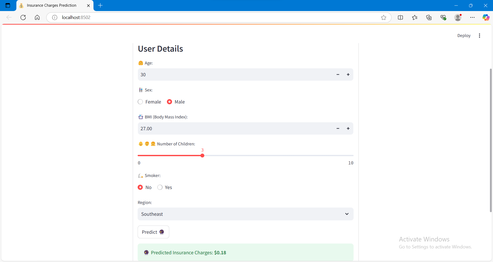

# Insurance Prediction APP (streamlit)
This project provides an APP(streamlit) for predicting insurance charges

## Table of Contents

- [Description](#description)
- [Requirements](#requirements)
- [Getting Started](#getting-started)
  - [1. Train and Save the Model](#1-train-and-save-the-model)
  - [2. Deploy FastAPI](#2-deploy-fastapi)
  - [3. Run Streamlit](#3-run-streamlit)
- [Usage](#usage)
  - [FastAPI Endpoints](#fastapi-endpoints)
- [Example Input and Output](#example-input-and-output)
- [File Structure](#file-structure)
- [Power Output Visualizations](#power-output-visualizations)
- [License](#license)

## Description

This project provides Streamlit application connected to an FASTAPI for predicting Insurance charges based on users input. The model uses XGBoost Regressor , trained on features including:

- **Age**
- **Gender**
- **BMI**
- **Number of children**
- **Smoker status**
- **Region**

The API predict Insurance charges in USD$, Based on these features

## Requirements

To set up and run this project, you need the following Python packages:

- `fastapi`
- `uvicorn`
- `scikit-learn`
- `pandas`
- `joblib`
- `numpy`
- `streamlit`
- `Xgboost`
- `python-dotenv`

Install these dependencies by running:

```bash
pip install -r requirements.txt
```
## Getting Started
1. Train and Save the Model

Train the Regressor model using scikit-learn and XGBoost Regressor, and save the trained model to a file. Run the following command in your terminal:
```bash
python model_build.py
```
This will create `model.pkl` files in the `model/` Directory

2. The FastAPI application (`api.py`) loads the saved model


```bash
uvicorn api:app --reload
```
This will start the sever at `http://0.0.0.0:8005 `


## EndPoints

- POST /api/predict
   - Decription:Accepts Insurance feature values and returns a predicted  Insurance charges in $.
```bash
{
   "Age": 30,
   "Gender": male,
   " BMI": 25.3,
   "children": 4,
   "Smoker": no,
    "Region": "southwest"
}
```
- Output JSON:
```bash
{
   "predicted_charges":0.72,
}
```
Age = 45
Gender = Female 
BMI = 28.7
Number of children = 2
Smoker Status = Yes
Region = southeast

Example Output:

Predicted Insurance Charge: $0.72

## File Structure 
The project directory is structured as follows:

```
📦 XGBoostRegressor API
├─ data
│  └─ data.csv
├─ model
│  └─ model.pkl
├─ src
├─ .gitignore
├─ app.py
├─ api.py
├─ model_built.py
├─ README.md
└─ requirements.txt
```
## License
This project is licensed under [](https://opensource.org/licenses/MIT)


